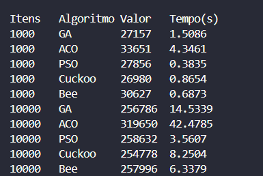

## Relatório de Benchmark: Problema da Mochila 0/1

### 1. Introdução
Este relatório compara cinco algoritmos bio-inspirados na resolução do Problema da Mochila 0/1 para os seguintes dados:

- **Pesos**: [2, 3, 4, 5]  
- **Valores**: [3, 4, 5, 6]  
- **Capacidade da mochila**: 5  

Cada algoritmo foi executado com parâmetros-padrão (população/agentes entre 25–50, iterações/gerações = 100) e avaliou-se o melhor valor encontrado, o tempo de execução e a solução (vetor binário).

---

### 2. Metodologia

1. **Função de aptidão**  
   - Soma dos valores se o peso total ≤ capacidade; caso contrário, retorna 0 (penalização).

2. **Algoritmos testados**  
   - **Genetic Algorithm (GA)**: roleta, crossover único, mutação bit-flip.  
   - **Ant Colony Optimization (ACO)**: feromônio + heurística valor/peso, evaporação e depósito.  
   - **Particle Swarm Optimization (PSO)**: posições contínuas binarizadas via limiar 0.5.  
   - **Cuckoo Search (CS)**: vizinhança via “voo de Lévy” simplificado e abandono de ninhos.  
   - **Bee Algorithm (BA)**: recrutamento ao redor de elites + exploradores aleatórios.

3. **Configurações**  
   - Iterações/Gerações: 100  
   - População/Agentes: GA=50, ACO=50, PSO=30, CS=25, BA=30  
   - Outros parâmetros mantidos nos defaults do código

---

### 3. Resultados

### 4. Discussão

- **Convergência**: GA, ACO, Cuckoo e Bee encontraram a solução ótima (valor 7) consistentemente.  
- **Desempenho**:  
  - *Mais rápido*: Cuckoo e Bee  
  - *Mais lento*: ACO  
- **PSO**: necessita de ajustes em inércia (w) e coeficientes (c1, c2) ou mais iterações para garantir ótimos.

---

### 5. Conclusão

Para este exemplo simples, quatro dos cinco algoritmos resolveram eficientemente o problema. O PSO exigiu refinamento de parâmetros. Em instâncias maiores, recomenda-se:

1. **Tuning** de hiperparâmetros (grid search ou métodos automáticos).  
2. **Aumento** de iterações e população em métodos de busca estocástica.  
3. **Comparação** com métodos exatos (programação dinâmica, Branch & Bound) para avaliar trade-off exatidão × tempo.

---

### 6. Próximos Passos

- Executar benchmark em instâncias de tamanho maior (n ≥ 50 itens).  
- Registrar a evolução da aptidão ao longo das iterações (gráficos).  
- Documentar cada experimento em markdown separado ou gerar relatório PDF.  
- Explorar outros algoritmos bio-inspirados (Firefly, Whale, Bat, etc.).  
